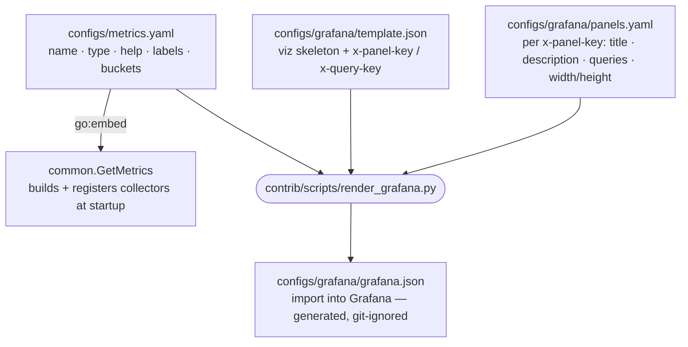

# Metrics & Grafana — single source of truth

Blockbook's prometheus metrics and its Grafana dashboard are generated from a few
source files, so metric names/help and panel queries/descriptions are never hand-synced.



## Files

| file | holds | committed |
|---|---|---|
| `../metrics.yaml` | every metric, keyed by a **stable id**: `name`, `type`, `help`, `labels`, `buckets` | yes |
| `template.json` | dashboard **skeleton** — rows, panel type, `fieldConfig`, `options`, plus a semantic `x-panel-key` per panel and `x-query-key` per target (the join keys). No titles/descriptions/exprs/legends, no `gridPos`, no `datasource`. | yes |
| `panels.yaml` | per-panel **content**, keyed by `x-panel-key` (e.g. `rpc.request_rate`): `title`, `description`, `queries` keyed by `x-query-key` (each with `promql` + `legend`), and optional `width`/`height` (default `8`×`8`; rows fill the row) | yes |
| `grafana.json` | the rendered dashboard you import into Grafana | **no** (git-ignored) |

`render_grafana.py` packs panels into Grafana's 24-column grid from template order and each panel's
`width`/`height` (panels.yaml), so the committed template carries no brittle `x/y` positions; it also
injects the single Prometheus `datasource` onto every panel and target, so the template repeats none.
It joins each `panels.yaml` entry to its template panel by `x-panel-key`, and each `queries:` entry to
a template target by `x-query-key` (Grafana's own `id`/`refId` stay in the template; the x-keys are
stripped from the rendered `grafana.json`). Inside `promql` / `description`, `{{name:<key>}}` /
`{{help:<key>}}` expand from `../metrics.yaml`, so a metric's name lives in one place and a rename
propagates to the Go binary and every panel.

Use stable, descriptive keys: `x-panel-key` should look like `<section>.<subject>[_stat]`
(for example `rpc.request_duration_p95`), and `x-query-key` should name the plotted series
(`requests`, `errors`, `p95`, `total`, `threshold`). Rename titles freely, but keep these keys
stable once other files refer to them.

## Render

```bash
python3 contrib/scripts/render_grafana.py          # write configs/grafana/grafana.json
python3 contrib/scripts/render_grafana.py --check  # validate alignment only, no write (CI)
```

`--check` fails on an unknown metric key, an invalid `width`/`height`, a `gridPos` or `datasource`
that leaked into `template.json`, a template ↔ `panels.yaml` `x-panel-key` or `x-query-key` mismatch,
a leftover placeholder, or any per-panel title/description/expr/legend that leaked into `template.json`.

> How to add or rename a metric or panel: see the **Metrics** section in `AGENTS.md`.
> The Grafana UI is preview-only — `template.json` + `panels.yaml` are the source.
