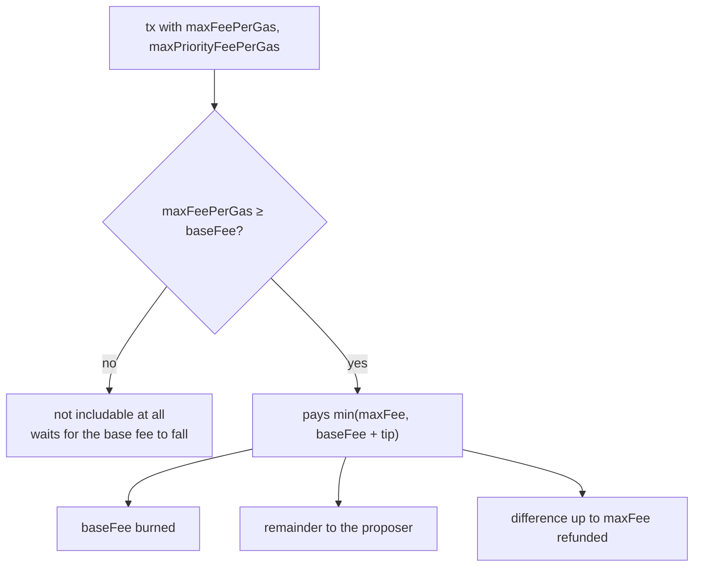

# EVM fees: the theory, and why estimating them is hard

This is the *why* document. It explains the mechanism EVM chains use to price transactions, what
part of it is genuinely an estimate, why the standard way of estimating it is biased, and how you
tell a good fee estimate from a bad one.

For *how blockbook implements* fee estimation — which call runs on which path, which config key
turns what on — see **[fees.md](fees.md)**. This document is the background that makes those
choices legible; it deliberately does not repeat them.

---

## 1. What a sender actually pays

### Before EIP-1559

A transaction named a single `gasPrice`, and blocks were filled highest-price-first. This is a
first-price sealed-bid auction, and it has the failure mode every first-price auction has: you
cannot bid your true value, because your true value is only correct if everyone else bid the same.
Wallets papered over it by bidding well above the clearing price, so users systematically overpaid
and still occasionally got stuck.

### After EIP-1559

The fee splits in two:

| component | who sets it | where it goes |
|---|---|---|
| **base fee** (`baseFeePerGas`) | the protocol, per block | **burned** |
| **priority fee** / tip (`maxPriorityFeePerGas`) | the sender, as a bid | the block proposer |

And the sender supplies two numbers, which are easy to confuse and do entirely different jobs:

- **`maxPriorityFeePerGas`** — the tip *bid*. What you are offering the proposer per unit of gas.
- **`maxFeePerGas`** — a *ceiling* on the total. Not a bid. A cap you set so a rising base fee
  cannot drain more than you agreed to.

### The payment rule

Given a block whose base fee is `b`:

```
eligible          ⟺  maxFeePerGas ≥ b
effective price   =  min(maxFeePerGas, b + maxPriorityFeePerGas)
proposer receives =  effective price − b
burned            =  b
refunded          =  maxFeePerGas − effective price
```



Three consequences that drive everything below:

1. **A high `maxFeePerGas` costs nothing.** The excess is refunded. Setting it generously is not
   overpaying — it is only a *displayed* number, and a promise about the worst case.
2. **The tip is the only thing you actually pay for.** Overestimate the tip and that money is gone.
3. **A low `maxFeePerGas` is not "cheaper", it is fragile.** Below the base fee your transaction is
   not slow, it is *ineligible* — it cannot enter a block until the base fee comes back down.

### How fast the base fee moves

The protocol adjusts the base fee toward a target of half the block gas limit, by at most **12.5%
per block** (a factor of 1/8). So a ceiling expressed as a multiple `m` of the current base fee
survives this many consecutive maximally-rising blocks:

```
blocks of head-room = ln(m) / ln(1.125)
```

That single formula is why `2×` is the conventional buffer: `ln(2)/ln(1.125) ≈ 5.9`, about six
blocks — long enough to ride out a burst, short enough to be an honest number to show a user.
`1.125^6 ≈ 2.03`.

It is also why a ceiling of `1.4×` — which is what one provider gives on Ethereum — is worth
worrying about: `ln(1.4)/ln(1.125) ≈ 2.9`. Three bad blocks and the transaction stops being
includable.

---

## 2. So what is there to estimate?

This is the part most discussions of "gas estimation" skip, and it is the crux. The three numbers a
wallet needs are of **three different kinds**:

| number | kind | how you get it |
|---|---|---|
| `baseFeePerGas` for the next block | **deterministic** | computed from the parent header |
| `maxPriorityFeePerGas` | **a genuine estimate** | inference about an auction |
| `maxFeePerGas` | **a policy decision** | how much head-room do you want |

- The next block's base fee is **not an estimate**. It is a pure function of the parent block's gas
  usage and base fee, fixed by consensus. Any component that "predicts" it is doing arithmetic, not
  forecasting. Getting it from an oracle rather than from the chain adds staleness for nothing.
- `maxFeePerGas` is **not an estimate either**. There is no true value to discover; there is a
  trade-off to choose between a scary displayed number and a stranded transaction. That is a product
  decision, and it belongs to whoever is accountable for the user experience — not to whichever
  third-party API happens to be configured.
- **Only the tip is actually estimated.** Everything hard about fee estimation lives here.

Recognising this split is what tells you where a defect belongs. A wrong base fee is a staleness
bug. A wrong ceiling is a policy bug. A wrong tip is an estimation bug. They have different fixes.

---

## 3. Why the tip is hard

### The right question, and the question everyone answers instead

The tip you need is the **marginal price of inclusion**: the smallest tip that still makes the cut
in the next block. Under a highest-tip-first ordering, that is the tip of the *last* transaction the
proposer had room for.

What almost every estimator computes instead is a **percentile of tips recently paid**. Those are
not the same quantity, and the gap between them is systematic, not random:

- If blocks are **full**, the marginal price is meaningful and a low percentile of paid tips
  approximates it reasonably.
- If blocks are **not full**, every transaction that offered anything at all got in. The marginal
  price collapses toward zero — while the *percentile of paid tips* stays wherever the
  non-price-sensitive senders put it. A 70th-percentile answer then says "pay what a fairly
  impatient stranger paid", which can be orders of magnitude above what inclusion required.

EIP-1559 targets blocks at **half full**. Slack is the normal condition, not the exception. So this
bias is not an edge case — it is the default regime, and it always errs toward overpaying.

### Zero-tip transactions poison the sample

A large share of blocks on major chains arrives through private orderflow: MEV bundles and
builder-direct submissions that pay the proposer out-of-band and set an on-chain tip of **zero**.
They are in the block, they occupy gas, and they tell you nothing whatsoever about what a public
transaction needs to bid.

This cuts both ways, and you have to decide deliberately:

- Include them and the low percentiles collapse to zero, so "what sufficed" looks like nothing and
  any real quote looks like an infinite overpay.
- Exclude them and you are hand-picking which transactions count.

There is no clean answer. What matters is that the choice is explicit and stated wherever the number
is reported.

### It is a forecast, not a measurement

The tip that works in block N+1 depends on demand that has not arrived yet. Every method is
backward-looking. In a calm market that is nearly harmless; during a spike, backward-looking
estimates are wrong in the dangerous direction precisely when it matters.

---

## 4. `eth_feeHistory`: what it actually computes

This is the standard primitive, and the one blockbook's on-chain path uses. It is worth knowing
exactly what it returns, because it is subtler than "the Nth percentile tip".

For each block and each requested percentile `p`, a node:

1. computes every transaction's **effective tip**, `min(maxPriorityFeePerGas, maxFeePerGas − baseFee)`
   — equivalently `effectiveGasPrice − baseFee`;
2. sorts the transactions by that tip, ascending;
3. walks the list accumulating **`gasUsed`**;
4. reports the tip of the transaction at which the running total first reaches
   `p% × block.gasUsed`.

Two things follow that trip people up:

- **It is gas-weighted, not transaction-weighted.** `reward[20]` is "the tip below which 20% of the
  block's *gas* sat", so one large contract call counts far more than one plain transfer. A
  count-based percentile computed from the same block will not match.
- **It is a percentile of what was paid**, so it inherits the bias in §3 wholesale. `eth_feeHistory`
  is an honest description of history; it is not an answer to "what do I need to bid".

### Backend divergence

`eth_feeHistory` is specified loosely enough that clients disagree in ways that silently shift array
indices:

- The response carries **one more `baseFeePerGas` entry than there are reward rows** — the
  projection for the block after the newest requested one.
- With `newestBlock: "pending"`, whether that projected element exists at all depends on whether the
  client has a distinct pending block. Erigon drops it; some L2 clients keep it, which shifts what
  index `blocks-1` means.
- On chains whose ordering ignores tips entirely, every reward comes back **zero** — correctly. See
  §7.

Any code reading a fixed index out of that array is making an assumption about the backend. Ours
does, and says so at the call site.

---

## 5. Where the numbers come from in blockbook

Briefly, to anchor the theory — [fees.md](fees.md) has the detail.

Two sources produce the tiers:

- **On-chain**: one `eth_feeHistory` call over 4 blocks at percentiles **20 / 70 / 99**. A tier is a
  percentile *plus* a window reducer — low = p20 max, medium = p70 median, high = p70 max,
  instant = p99 max — and the result is forced non-decreasing. Measured over a 12h capture, the
  90th percentile cost ~7× the 70th on Ethereum while adding under a point of next-block inclusion,
  so High now separates from Normal by reading the same percentile more pessimistically rather than
  by climbing the distribution.
- **Alternative provider**: a third-party gas API (Infura or 1inch), polled in the background and
  served from cache.

Both are percentile-of-paid methods, so both carry the §3 bias. There is still no model of urgency —
only cut points on one distribution, plus how defensively the window around them is read.

Two structural points worth holding onto:

- **The ceiling is ours, not the provider's.** Provider `maxFeePerGas` values are rewritten to
  `2 × baseFee + tip` before being served (`normalizedProviderFees`), because §2 says head-room is a
  policy decision and §1 says it costs nothing to be generous. Providers pad by arbitrary factors of
  their own — measured anywhere from 1.4× to 10× the base fee — and inheriting that means inheriting
  someone else's risk appetite.
- **Trezor Suite passes `maxFeePerGas` through and both displays and reserves
  `maxFeePerGas × gasLimit`.** So the ceiling, which costs nothing to *pay*, is exactly the number
  the user is shown and the amount subtracted from a send-max. A generous ceiling is free in money
  and expensive in perception.

---

## 6. How to tell whether an estimate is any good

The awkward part: you cannot observe the counterfactual. The transaction you quoted was never sent,
so "would it have been included?" has no recorded answer.

What you can do is **replay** it. Take a quote made at height `H`, then use the §1 payment rule
against the blocks that actually followed:

```
for i in 1..k:
    b = baseFee(H+i)
    if maxFeePerGas < b:            continue        # ineligible this block
    price = min(maxFeePerGas, b + tip)
    if price ≥ clearing_price(H+i):  included at H+i; stop
```

That yields two **independent** measures, and no single number can stand in for both:

- **Price error** — `effective price / clearing price`. How much was wasted.
- **Reliability** — the share of quotes included within `k` blocks, and how long they waited.

They trade off against each other, so an estimator can only be judged on both at once. The cheapest
source in a sample is often cheapest because it under-provisions, and that only shows up in the
reliability column.

Two derived numbers are worth reporting alongside:

- **Head-room in blocks** — `ln(maxFee/baseFee) / ln(1.125)`, from §1. This is a *forward-looking*
  robustness measure and the only one that says anything about the congestion you did not sample.
- **Displayed inflation** — `maxFee × gasLimit` over the real cost, because §5 says that is the
  number the user actually sees.

### Choosing a clearing price

The replay needs a threshold per block, and this is where §3's zero-tip problem lands:

- the **minimum** included effective price is the true marginal price, but it is usually a zero-tip
  private bundle and therefore meaningless;
- a **low percentile** (say the 10th) is robust and interpretable, at the cost of being slightly
  pessimistic about what would have squeezed in.

Report which one you used. The multiples move by orders of magnitude between them.

### The trap in a calm sample

In a flat market every plausible quote gets included, so **reliability looks perfect for everything**
and price is the only axis that separates sources. That is exactly the condition in which a thin
ceiling looks free. A measurement window without a base-fee spike cannot rank estimators on
robustness, and should not be used to.

---

## 7. Failure modes worth recognising

A taxonomy, because these recur and each has a different tell:

| failure | tell | why it happens |
|---|---|---|
| **Static constant** | the value never changes across a long window | a provider's default that stopped tracking a market that moved under it |
| **Percentile overshoot** | large multiple, 100% next-block inclusion | §3 — pricing off what others paid while blocks have slack |
| **Thin ceiling** | low `maxFee/baseFee`, waits and stalls under load | inherited provider head-room; §1 ineligibility |
| **Padded ceiling** | inflated displayed fee, correct amount paid | provider padding passed through; costs perception and send-max, not money |
| **Degenerate ladder** | two tiers byte-identical | a provider floor collapsing distinct percentiles onto one value |
| **Unit confusion** | off by 10⁹ | gas APIs return **Gwei** as decimal strings; the chain speaks **wei** |
| **Integer overflow** | a huge fee appears negative | wei above 2⁶³−1 wrapping on an `int64` cast; real on high-fee L2s |
| **Missing cost component** | estimate below the fee actually charged | a chain with a fee term outside `gasUsed × gasPrice` (§8) |

The static-constant case deserves emphasis because it is the one that *grows into existence*. A flat
tip is harmless when it is small relative to the base fee and becomes egregious when base fees fall.
Nothing changes on the day it breaks — which is why it needs a monitor comparing the served value to
an independent one, not a review.

---

## 8. Where the L2s differ

Reasoning from Ethereum mainnet transfers badly. Per chain:

- **Arbitrum (Nitro)** — the sequencer orders by arrival time, not by tip. Tipping buys nothing, and
  `eth_feeHistory` correctly returns all-zero rewards. The right tip is **zero**, and any estimator
  that always returns something positive is wrong by construction here.
- **OP-stack (Optimism, Base)** — the total cost is the L2 execution fee *plus* a per-transaction L1
  data component. Blockbook includes it in a transaction's reported `fees` but the estimate path
  covers only `gasPrice × gasLimit`, so the two do not reconcile exactly. Post-blobs this term is
  small, but it is not zero and it is not proportional to L2 gas.
- **Polygon (bor)** — enforces a high minimum priority fee, tens of Gwei. Sub-Gwei intuitions and
  any absolute floor tuned for Ethereum are meaningless here; only ratios transfer.
- **Chains with a near-constant base fee** — several L2s hold the base fee at a floor for long
  stretches. Head-room in "blocks of 12.5% growth" is then a vacuous measure, because the base fee
  is not doing that.
- **High-fee chains** — base fees in the hundreds of Gwei make the `int64` overflow above a live
  concern rather than a theoretical one.

---

## 9. Measuring it here

`contrib/scripts/feeaudit` implements §6 against public endpoints only: it takes websocket
`estimateFee` quotes anchored to block heights, reads back every following block's transactions for
ground truth, and replays each quote under the §1 payment rule. It scores the served quote, the
alternative providers, and blockbook's own on-chain algorithm as sibling rows so they are compared on
identical market conditions.

Because it has no backend access it reconstructs `eth_feeHistory` offline from block data using the
§4 definition. That reconstruction is checkable — `-validate <rpc-url>` compares it wei-for-wei
against a real node — and should be re-checked rather than trusted, since §4 is where clients
diverge.

```sh
go run contrib/scripts/feeaudit/main.go -chains eth,pol -duration 30m -out /tmp/feeaudit
go run contrib/scripts/feeaudit/main.go -chains avax -validate https://api.avax.network/ext/bc/C/rpc
```

What a 35-minute sample across eight chains showed, as an illustration of the taxonomy rather than a
standing result: a static 2 Gwei tip on Ethereum against a market clearing three orders of magnitude
lower (static constant + percentile overshoot); ceilings from 1.4× to 10× the base fee depending on
provider (thin and padded, on different chains); and one candidate that priced at the going rate
while leaving 28% of transactions unmined for eight blocks (thin ceiling, visible only because
reliability was measured separately). No source was best everywhere — which §3 predicts, since they
are all answering the same slightly-wrong question.

---

## 10. Reference

- **EIP-1559** — the fee-market mechanism: <https://eips.ethereum.org/EIPS/eip-1559>
- **`eth_feeHistory`** — <https://ethereum.org/en/developers/docs/apis/json-rpc/#eth_feehistory>
- **[fees.md](fees.md)** — how blockbook implements the above
- `bchain/coins/eth/ethrpc.go` — `EthereumTypeGetEip1559Fees`, `normalizedProviderFees`
- `bchain/coins/eth/infurafees.go`, `oneinchfees.go` — the provider adapters
- `contrib/scripts/feeaudit/` — the measurement harness
