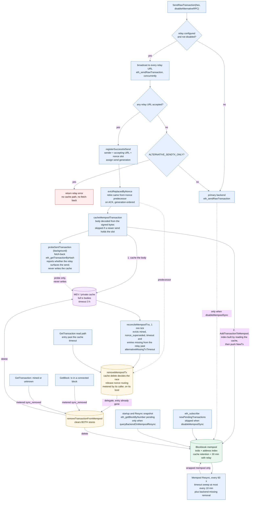
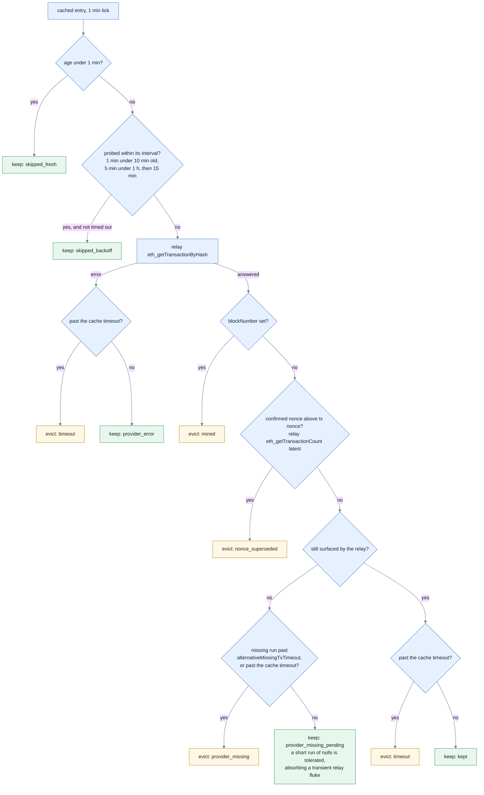
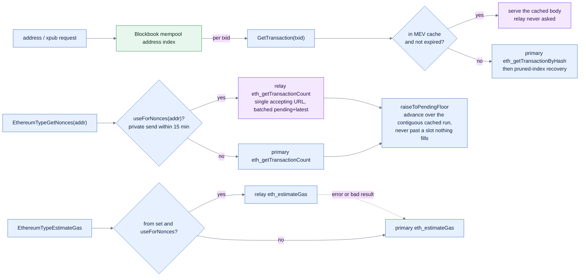

# EVM pending-transaction stores

Blockbook keeps EVM pending transactions in **two** stores when a coin is configured with a private
send-tx relay (`*_ALTERNATIVE_SENDTX_URLS`, `*_ALTERNATIVE_SENDTX_ONLY`,
`*_ALTERNATIVE_FETCH_MEMPOOL_TX`); without one only the Blockbook mempool exists. The broadcast flow
and its invariants are in [evm-send.md](/docs/evm-send.md); this page maps the two stores.

| | Blockbook mempool | MEV / private cache |
|---|---|---|
| Type | `bchain.MempoolEthereumType` (`b.Mempool`) | `eth.AlternativeSendTxProvider.mempoolTxs` |
| Holds | txid + address index (+ token transfers) | full `RpcTransaction` body, sender, nonce, send generation |
| Populated from | `newPendingTransactions` WS feed; the resync snapshot; own successful sends when `disableMempoolSync` | only sends a relay ACKed, in `ALTERNATIVE_SENDTX_ONLY` + `ALTERNATIVE_FETCH_MEMPOOL_TX` mode — from the signed bytes alone |
| Serves | address and xpub txs (`GetAddrDescTransactions`), wallet `NewTx` pushes | tx bodies on `GetTransaction`, the pending-nonce floor |
| Retention | `mempoolTxTimeout` — the cache retention + 30 min when a relay is configured, else `mempoolTxTimeoutHours` | `alternativePendingTxWindow` — 3 h, the window in which a privately broadcast tx can still be built into a block |
| Reconciled | `Resync` every ~60 s; timeout sweep at most every 10 min | `reconcileMempoolTxs` on a 1 min tick, against the relay; an entry is re-probed less often as it ages |

A private transaction is in **both**: the cache holds the body and is the source of truth, the wrapped
mempool the index built from it. A public transaction is only ever in the mempool.

Two couplings between the stores are load-bearing:

- `AddTransactionToMempool` builds its address index through `GetTransactionForMempool` →
  `GetTransaction`, which reads the cache first, so a private transaction must be cached *before* it
  is added to the wrapped mempool or it cannot be indexed at all. The body comes from the send's own
  signed bytes and the fetch-back never writes the cache, so this holds even when the relay never
  surfaces the transaction (see [evm-send.md](/docs/evm-send.md)).
- The cache must expire **before** the wrapped mempool. Every cache exit clears the wrapped mempool
  too, but the mempool's own timeout sweep does not clear the cache; inverted, a private transaction
  loses its address index while still being served as pending. The mempool default is *derived* from
  the cache retention, so only an explicit `mempoolTxTimeout` can invert the pair, and `CreateMempool`
  then refuses to start.

## Broadcast, ingest and eviction

## What the cache reconcile decides, per entry

Evaluated in this order on every one-minute tick, for every cached transaction the probe backoff lets
through. The labels are the `action` values of
`blockbook_eth_alternative_mempool_reconciliation_events_total`; every `evict:` box goes through
`removeMempoolTx` in the first diagram, and is metered by the caller rather than there.

A mined private transaction is usually cleared by block sync first, counted as `sync_removed`, before
the next probe reaches the `mined` branch here.

## How the two stores are read back

Only addresses that sent through the relay in the last 15 minutes are routed to it (`useForNonces`);
everything else is served by the primary backend. That window is much shorter than the cache retention
on purpose — see [evm-send.md](/docs/evm-send.md#how-long-a-private-transaction-stays-pending).

