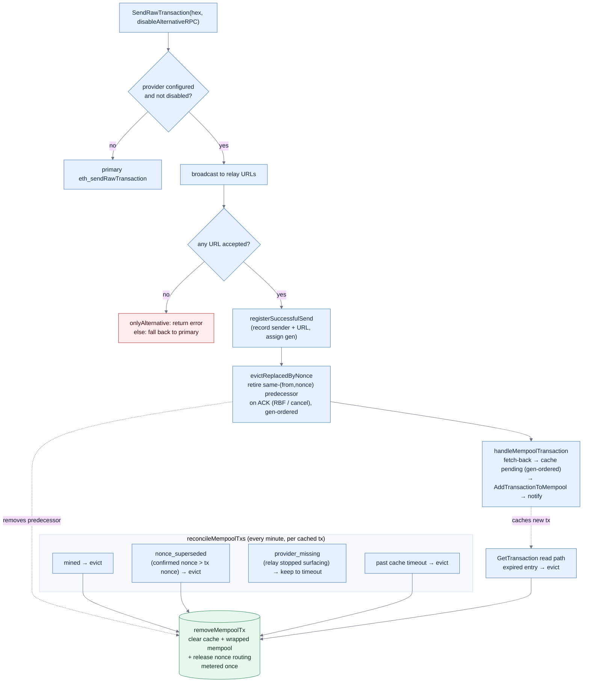

# EVM transaction submission

This page documents how Blockbook broadcasts a **Trezor Suite** EVM transaction through the
private send-tx relay and tracks it in its own pending-transaction cache until the chain confirms
or supersedes it. Fee estimation — a separate step of the same send flow — is covered in
[fees.md](/docs/fees.md) and is not repeated here.

The private-relay pieces (the alternative send-tx provider and its pending-tx cache) are active
only when a coin is configured with the `*_ALTERNATIVE_SENDTX_URLS`, `*_ALTERNATIVE_SENDTX_ONLY`,
and `*_ALTERNATIVE_FETCH_MEMPOOL_TX` environment variables. Without them Blockbook sends through
the normal backend RPC and the cache path below is skipped.

## Broadcast and the pending-transaction cache

`SendRawTransaction` broadcasts and — when the relay accepts and the coin runs in
`ALTERNATIVE_SENDTX_ONLY` + `ALTERNATIVE_FETCH_MEMPOOL_TX` mode — keeps its own pending-tx cache,
because the relay exposes no mempool to reconcile against. A background loop and the read path
reconcile that cache against the chain.

Key invariants:

- **A same-`(from, nonce)` predecessor is retired the moment the relay ACKs its replacement**, from
  the raw hex — not by waiting for the relay to surface the replacement. A Blink drop-mode cancel
  is never surfaced and its nonce is never consumed on-chain, so without this the superseded tx
  lingered as "Unconfirmed" until the cache timeout. This is deliberately distinct from an *empty*
  `eth_getTransactionByHash` probe, which is **not** authoritative — a private relay stops
  surfacing a still-mineable tx while it stays broadcast, so `provider_missing` is kept until the
  timeout rather than evicted early. `mined` and `nonce_superseded` are the only deterministic
  early evictions the reconcile loop makes.
- **Send generations order concurrent same-nonce sends.** Each accepted send gets a monotonic
  generation; an older submission's slow fetch-back neither caches itself over, nor evicts, a
  newer replacement that already holds the nonce slot.
- **Every exit funnels through `removeMempoolTx`**, which clears the provider cache *and* the
  wrapped Blockbook mempool (address index), releases the sender's nonce routing once nothing
  private remains pending, and records the lifecycle metric exactly once (gated on the actual
  removal, so concurrent reconcile / read-path / RBF evictions of the same entry don't
  double-count).
- **Removals are not pushed to the wallet.** Blockbook pushes only *added* txs; a wallet learns a
  pending tx is gone on its next account re-fetch (the initiating device also removes it
  optimistically). The cache timeout is the backstop for anything the deterministic evictions miss.

## Observability

Prometheus counters for the cache lifecycle:

- `blockbook_eth_alternative_mempool_reconciliation_events_total{action}` — cache exits by reason
  (`mined`, `nonce_superseded`, `provider_missing`, `timeout`, `rbf_replaced`, plus the kept
  actions `skipped_fresh`, `provider_missing_pending`, `kept`, `provider_error`).
- `blockbook_eth_alternative_mempool_tx_residence_seconds{action}` — how long an entry lived before
  each eviction reason fired (e.g. `provider_missing` clustering near the timeout rather than at
  ~1–2 min would flag a premature-eviction regression).
- `blockbook_eth_alternative_mempool_cache_size` — current cache depth.
