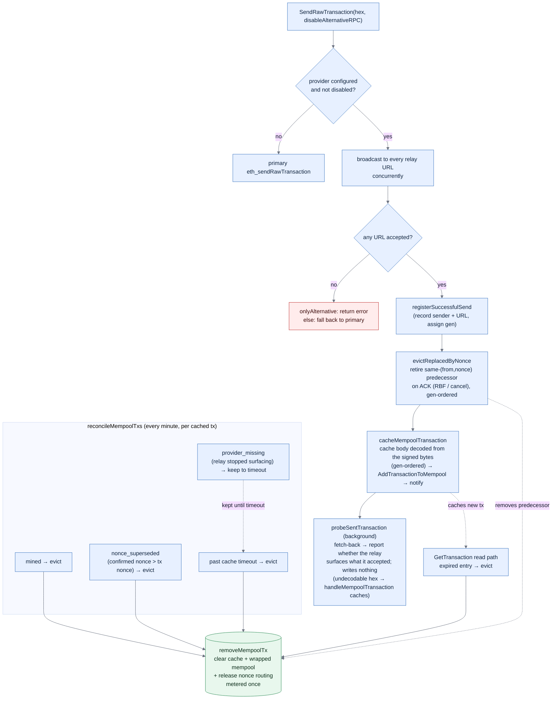

# EVM transaction submission

This page documents how Blockbook broadcasts a **Trezor Suite** EVM transaction through the
private send-tx relay and tracks it in its own pending-transaction cache until the chain confirms
or supersedes it. Fee estimation — a separate step of the same send flow — is covered in
[fees.md](/docs/fees.md) and is not repeated here.

The private-relay pieces (the alternative send-tx provider and its pending-tx cache) are active
only when a coin is configured with the `*_ALTERNATIVE_SENDTX_URLS`, `*_ALTERNATIVE_SENDTX_ONLY`,
and `*_ALTERNATIVE_FETCH_MEMPOOL_TX` environment variables. Without them Blockbook sends through
the normal backend RPC and the cache path below is skipped.

## Broadcast and the pending-transaction cache

`SendRawTransaction` broadcasts and — when the relay accepts and the coin runs in
`ALTERNATIVE_SENDTX_ONLY` + `ALTERNATIVE_FETCH_MEMPOOL_TX` mode — keeps its own pending-tx cache,
because the relay exposes no mempool to reconcile against. A background loop and the read path
reconcile that cache against the chain.

```mermaid
%%{init: {"theme": "base", "themeVariables": {"lineColor": "#6b7280", "primaryTextColor": "#111827"}}}%%
flowchart TD
    send["SendRawTransaction(hex, disableAlternativeRPC)"]
    route{"provider configured<br/>and not disabled?"}
    primary["primary eth_sendRawTransaction"]
    relay["broadcast to every relay URL<br/>concurrently"]
    acc{"any URL accepted?"}
    reject["onlyAlternative: return error<br/>else: fall back to primary"]
    reg["registerSuccessfulSend<br/>(record sender + URL, assign gen)"]
    evict["evictReplacedByNonce<br/>retire same-(from,nonce) predecessor<br/>on ACK (RBF / cancel), gen-ordered"]
    cache["cacheMempoolTransaction<br/>cache body decoded from the signed bytes<br/>(gen-ordered) → AddTransactionToMempool → notify"]
    handle["probeSentTransaction (background)<br/>fetch-back → report whether the relay<br/>surfaces what it accepted; writes nothing<br/>(undecodable hex → handleMempoolTransaction caches)"]

    subgraph rec ["reconcileMempoolTxs (every minute, per cached tx)"]
        mined["mined → evict"]
        super["nonce_superseded<br/>(confirmed nonce > tx nonce) → evict"]
        miss["provider_missing<br/>(relay stopped surfacing) → keep to timeout"]
        to["past cache timeout → evict"]
    end

    readpath["GetTransaction read path<br/>expired entry → evict"]
    remove[("removeMempoolTx<br/>clear cache + wrapped mempool<br/>+ release nonce routing<br/>metered once")]

    send --> route
    route -- "no" --> primary
    route -- "yes" --> relay --> acc
    acc -- "no" --> reject
    acc -- "yes" --> reg --> evict --> cache --> handle
    evict -. removes predecessor .-> remove
    cache -. caches new tx .-> readpath
    mined --> remove
    super --> remove
    miss -. "kept until timeout" .-> to
    to --> remove
    readpath --> remove

    classDef normal fill:#e7f0ff,stroke:#4078c0,color:#10243e;
    classDef store fill:#e8f7ed,stroke:#2e8b57,color:#0b2c19;
    classDef error fill:#ffecec,stroke:#c03535,color:#3b0a0a;
    class send,route,relay,acc,reg,evict,cache,handle,mined,super,miss,to,readpath,primary normal;
    class remove store;
    class reject error;
```

Key invariants:

- **On the relay-accepted path, the wallet's answer waits for the broadcast and nothing else.** The
  broadcast to every configured relay URL runs concurrently, so it costs the slowest single URL
  instead of the sum of all of them; the caching below is local work; and the fetch-back runs in the
  background. This matters beyond latency: a wallet that gives up before Blockbook answers tells the
  user the send failed while it is on its way to the chain, and a re-send at the next nonce then pays
  the recipient twice. Trezor Suite's per-request deadline is 20 s today and 60 s for pushes once
  [trezor-suite#30846](https://github.com/trezor/trezor-suite/pull/30846) lands, against `rpc_timeout`
  of 25 s *per relay URL*.

  The fall-through path is not bounded that way. When no relay accepts and `ALTERNATIVE_SENDTX_ONLY`
  is not set, the answer additionally waits for the primary `eth_sendRawTransaction` and, on the
  `disableMempoolSync` coins, for the mempool add that makes an own send visible — which costs one
  primary `eth_getTransactionByHash`, plus the pruned-index recovery's `eth_getTransactionReceipt`
  when that answers null. Up to 3–4 × `rpc_timeout` in total, and the same tail exists on those coins
  with no relay configured at all. The add is skipped when the send itself failed, since there is then
  no txid to index.
- **An accepted send is cached from its own signed bytes, before the relay is asked about it.**
  Everything a pending `RpcTransaction` carries is in the signed transaction, so the fetch-back does
  not write the cache at all — it only reports whether the relay surfaces what it accepted. It must
  not: by the time it answers the transaction may have mined and block sync may have cleared it, and
  the relay's own view can name a different hash, `to` or `value` than the bytes Blockbook was given.
  A relay that accepts a transaction and then does not surface it (or is briefly unreachable)
  therefore no longer leaves the send exposed nowhere at all. It used to be neither served as pending,
  nor present in the address index, nor raising the pending-nonce floor, leaving its nonce free for
  the next send to reuse. The txid is the hash of the
  signed bytes rather than the relay's echo, so the cache, the address index and the answer to the
  wallet all name what the chain will show. The one exception is a raw transaction Blockbook cannot
  decode: nothing can be derived from it, so there the fetch-back is still the only thing that can
  expose it and keeps its create semantics.
- **What is cached is what a relay accepted, which is not the same as what will mine.** A transaction
  the relay drops or never mines — a Blink drop-mode cancel is the deliberate case — holds its nonce
  slot, and with it the pending-nonce floor, until the cache timeout. A wallet's next send is then
  built above a nonce nothing will consume and waits for the floor to fall. That is the accepted side
  of the #1638 trade: a gap that self-heals within the cache timeout, rather than handing out a nonce
  that is genuinely in flight and letting two transactions pay the same recipient.
- **A same-`(from, nonce)` predecessor is retired the moment the relay ACKs its replacement**, from
  the raw hex — not by waiting for the relay to surface the replacement. A Blink drop-mode cancel
  is never surfaced and its nonce is never consumed on-chain, so without this the superseded tx
  lingered as "Unconfirmed" until the cache timeout. This is deliberately distinct from an *empty*
  `eth_getTransactionByHash` probe, which is **not** authoritative — a private relay stops
  surfacing a still-mineable tx while it stays broadcast, so `provider_missing` is kept until the
  timeout rather than evicted early. `mined` and `nonce_superseded` are the only deterministic
  early evictions the reconcile loop makes.
- **Send generations order concurrent same-nonce sends.** Each accepted send gets a monotonic
  generation; an older submission's slow fetch-back neither caches itself over, nor evicts, a
  newer replacement that already holds the nonce slot.
- **Every exit funnels through `removeMempoolTx`**, which clears the provider cache *and* the
  wrapped Blockbook mempool (address index), releases the sender's nonce routing once nothing
  private remains pending, and records the lifecycle metric exactly once (gated on the actual
  removal, so concurrent reconcile / read-path / RBF evictions of the same entry don't
  double-count).
- **Removals are not pushed to the wallet.** Blockbook pushes only *added* txs; a wallet learns a
  pending tx is gone on its next account re-fetch (the initiating device also removes it
  optimistically). The cache timeout is the backstop for anything the deterministic evictions miss.

## Observability

Prometheus counters for the cache lifecycle:

- `blockbook_eth_alternative_mempool_reconciliation_events_total{action}` — cache exits by reason
  (`mined`, `nonce_superseded`, `provider_missing`, `timeout`, `rbf_replaced`, `sync_removed`, plus
  the kept actions `skipped_fresh`, `provider_missing_pending`, `kept`, `provider_error`).
  `sync_removed` covers the exits with no reconcile decision — block sync indexing the transaction's
  block, or the read path finding it mined. Expect it to dominate and `mined` to be rare: block sync
  clears a confirmed private tx well before the next reconcile probe would see it.
- `blockbook_eth_alternative_mempool_tx_residence_seconds{action}` — how long an entry lived before
  each eviction reason fired. `provider_missing` clustering near the cache timeout is the healthy
  shape; clustering at ~1–2 min instead is the premature-eviction regression #1573 describes.
- `blockbook_eth_alternative_mempool_cache_size` — current cache depth.

Signals that reveal *hanging* private transactions (a tx stuck Unconfirmed, or a nonce pinned above
a dead on-chain gap):

- `blockbook_eth_alternative_mempool_oldest_age_seconds` — age of the oldest still-cached entry,
  sampled per reconcile cycle. The residence histogram only records an age once an entry leaves, so a
  stuck tx is invisible until it times out; this gauge exposes it live. Climbing toward the cache
  timeout at non-zero depth means cached txs are dying underpriced rather than mining — with one
  benign cause to rule out first: a transaction that by design never mines (a drop-mode cancel) sits
  out the full timeout too.
- `blockbook_eth_alternative_send_not_surfaced_total{reason}` — a relay-accepted send the
  fetch-back did not surface (`not_found`/`error`), or never ran because too many were already in
  flight (`dropped`, counted only on the raw-hex-decode-failure path, where the fetch-back is the only
  thing that can expose the transaction — a `dropped` there means that send really is exposed
  nowhere). The transaction is otherwise still cached and indexed from its signed bytes (unless those
  did not decode, which is logged as `cannot decode accepted
  transaction`), so this is no longer a nonce-reuse precursor; it means the relay does not report
  back what it accepted, so the entry cannot be reconciled against the relay's view and only the
  cache timeout can retire it.
- `blockbook_eth_alternative_pending_floor_raised_total{source}` — `raiseToPendingFloor` lifted the
  reported pending nonce above the backend's own answer (`provider`: the relay had already dropped
  the still-cached tx past its ~1-min pending window; `primary`: the fallback RPC never knew it). A
  sustained rate is the precursor to a wallet queueing its next send behind a nonce the relay has
  abandoned.
