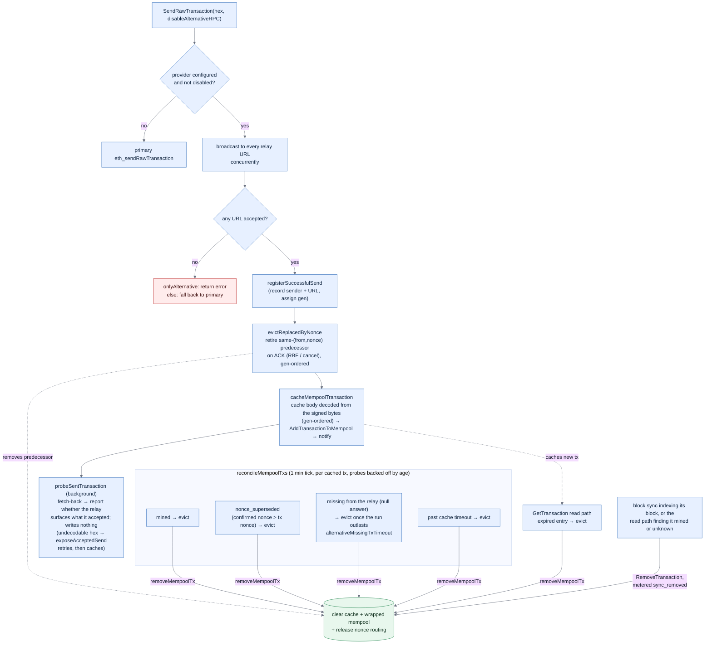

# EVM transaction submission

How Blockbook broadcasts a **Trezor Suite** EVM transaction through the private send-tx relay and
tracks it in its own pending-transaction cache until the chain confirms or supersedes it. Fee
estimation is covered in [fees.md](/docs/fees.md).

The two pieces switch on separately. **Broadcasting** through the relay needs only
`*_ALTERNATIVE_SENDTX_URLS`: set it and every send goes to the relay, with no URL configured Blockbook
sends through the normal backend RPC. The **pending-tx cache** below additionally needs
`*_ALTERNATIVE_SENDTX_ONLY` and `*_ALTERNATIVE_FETCH_MEMPOOL_TX`; without them the relay still
broadcasts but Blockbook keeps no pending state of its own.

## Broadcast and the pending-transaction cache

`SendRawTransaction` broadcasts and, when the relay accepts in `ALTERNATIVE_SENDTX_ONLY` +
`ALTERNATIVE_FETCH_MEMPOOL_TX` mode, keeps its own pending-tx cache — the relay exposes no mempool to
reconcile against. A background loop and the read path reconcile that cache against the chain.

```mermaid
%%{init: {"theme": "base", "themeVariables": {"lineColor": "#6b7280", "primaryTextColor": "#111827"}}}%%
flowchart TD
    send["SendRawTransaction(hex, disableAlternativeRPC)"]
    route{"provider configured<br/>and not disabled?"}
    primary["primary eth_sendRawTransaction"]
    relay["broadcast to every relay URL<br/>concurrently"]
    acc{"any URL accepted?"}
    reject["onlyAlternative: return error<br/>else: fall back to primary"]
    reg["registerSuccessfulSend<br/>(record sender + URL, assign gen)"]
    evict["evictReplacedByNonce<br/>retire same-(from,nonce) predecessor<br/>on ACK (RBF / cancel), gen-ordered"]
    cache["cacheMempoolTransaction<br/>cache body decoded from the signed bytes<br/>(gen-ordered) → AddTransactionToMempool → notify"]
    handle["probeSentTransaction (background)<br/>fetch-back → report whether the relay<br/>surfaces what it accepted; writes nothing<br/>(undecodable hex → exposeAcceptedSend<br/>retries, then caches)"]

    subgraph rec ["reconcileMempoolTxs (1 min tick, per cached tx, probes backed off by age)"]
        mined["mined → evict"]
        super["nonce_superseded<br/>(confirmed nonce > tx nonce) → evict"]
        miss["missing from the relay (null answer)<br/>→ evict once the run outlasts<br/>alternativeMissingTxTimeout"]
        to["past cache timeout → evict"]
    end

    readpath["GetTransaction read path<br/>expired entry → evict"]
    syncrm["block sync indexing its block, or the<br/>read path finding it mined or unknown"]
    remove[("clear cache + wrapped mempool<br/>+ release nonce routing")]

    send --> route
    route -- "no" --> primary
    route -- "yes" --> relay --> acc
    acc -- "no" --> reject
    acc -- "yes" --> reg --> evict --> cache --> handle
    evict -. removes predecessor .-> remove
    cache -. caches new tx .-> readpath
    mined -- "removeMempoolTx" --> remove
    super -- "removeMempoolTx" --> remove
    miss -- "removeMempoolTx" --> remove
    to -- "removeMempoolTx" --> remove
    readpath -- "removeMempoolTx" --> remove
    syncrm -- "RemoveTransaction,<br/>metered sync_removed" --> remove

    classDef normal fill:#e7f0ff,stroke:#4078c0,color:#10243e;
    classDef store fill:#e8f7ed,stroke:#2e8b57,color:#0b2c19;
    classDef error fill:#ffecec,stroke:#c03535,color:#3b0a0a;
    class send,route,relay,acc,reg,evict,cache,handle,mined,super,miss,to,readpath,syncrm,primary normal;
    class remove store;
    class reject error;
```

Key invariants:

- **On the relay-accepted path, the wallet's answer waits for the broadcast and nothing else.** The
  broadcast to every relay URL runs concurrently, so it costs the slowest URL, not their sum; caching
  is local work and the fetch-back is background. A wallet that gives up before Blockbook answers
  tells the user the send failed while it is on its way to the chain, and a re-send at the next nonce
  then pays the recipient twice. Trezor Suite's deadline is 20 s per request, 110 s for pushes once
  [trezor-suite#30846](https://github.com/trezor/trezor-suite/pull/30846) lands — sized to the
  fall-through tail below, not just the relay leg's one `rpc_timeout` (25 s).

  The fall-through path is not bounded that way. With no relay acceptance and
  `ALTERNATIVE_SENDTX_ONLY` unset, the answer also waits for the primary `eth_sendRawTransaction` and,
  on `disableMempoolSync` coins, for the mempool add that makes an own send visible: one primary
  `eth_getTransactionByHash` plus the pruned-index recovery's `eth_getTransactionReceipt` when that
  answers null, up to 3–4 × `rpc_timeout` in total. The same tail exists there with no relay at all.
  The add is skipped on a failed send — no txid to index.
- **An accepted send is cached from its own signed bytes, before the relay is asked about it.** The
  signed transaction carries everything a pending `RpcTransaction` needs, so the fetch-back writes
  nothing and only reports whether the relay surfaces what it accepted. It must not write: by then the
  transaction may have mined and block sync may have cleared it, and the relay's view can name a
  different hash, `to` or `value` than the bytes Blockbook was given. So a relay that accepts and then
  does not surface a transaction no longer leaves the send exposed nowhere — not served as pending,
  not indexed, not raising the pending-nonce floor, its nonce free to reuse. The txid is the hash of
  the signed bytes, not the relay's echo, so cache, address index and the wallet's answer all name what
  the chain will show. Exception: an undecodable raw transaction, where nothing can be derived and the
  fetch-back keeps its create semantics as the only thing that can expose the send.
- **What is cached is what a relay accepted, which is not the same as what will mine.** A transaction
  the relay drops — a Blink drop-mode cancel is the deliberate case — stops being surfaced, so
  reconcile retires it once its run of null answers outlasts `alternativeMissingTxTimeout` (2 min by
  default), releasing its nonce slot and the pending-nonce floor with it. A transaction the relay
  keeps surfacing but nobody mines holds its slot for the whole pending window; that is the accepted
  side of the #1638 trade: a reserved dead nonce beats handing out one that is genuinely in flight.
  What bounds it is the floor's contiguity rule — the floor never advances *past* an unfilled slot,
  so the wallet always gets a usable nonce and only the stuck private transaction is affected, not
  every send after it (#1675). Suite can speed it up or cancel it for the whole window.
- **Every same-`(from, nonce)` predecessor is retired the moment the relay ACKs its replacement** —
  only one transaction per slot can mine — from the raw hex, not on the relay surfacing the
  replacement: a Blink drop-mode cancel is never surfaced and never consumes its nonce on-chain, which
  left the superseded tx "Unconfirmed" until the cache timeout (#1573). This is deliberately distinct
  from an *empty* `eth_getTransactionByHash` probe: the relay answers from one consistent store over
  its whole pending window (the Blinklabs alignment), so a run of nulls does evict — but only after
  `alternativeMissingTxTimeout`, a short tolerance that absorbs a transient relay fluke rather than
  evicting on a single answer. `mined` and `nonce_superseded` stay reconcile's immediate
  deterministic evictions.
- **Send generations order concurrent same-nonce sends.** Each accepted send gets a monotonic
  generation; an older submission's slow fetch-back neither caches itself over, nor evicts, a newer
  replacement that already holds the nonce slot.
- **Every exit clears both stores and is metered exactly once.** The reconcile and RBF evictions go
  through `removeMempoolTx`; `sync_removed` — block sync, and the read path finding a transaction
  mined or unknown — goes through `RemoveTransaction` directly. Neither meters anything itself:
  `removeMempoolTx` passes an empty action, so its callers do the metering, gated on the bool it
  returns, and `RemoveTransaction` passes `sync_removed`, which nothing else would record. The gating
  is what keeps concurrent reconcile / read-path / RBF evictions of the same entry from
  double-counting.
- **Removals are not pushed to the wallet.** Blockbook pushes only *added* txs; a wallet learns a
  pending tx is gone on its next account re-fetch (the initiating device also removes it
  optimistically). The cache timeout, at the pending window's length, is only the backstop: in
  practice `sync_removed` retires an entry, with `nonce_superseded` covering a replacement submitted
  outside Blockbook.

## How long a private transaction stays pending

A privately broadcast transaction can be built into a block for around three hours (Blinklabs'
figure), and the relay's `eth_getTransactionByHash` and pending `eth_getTransactionCount` answers
cover that same window — they used to stop after roughly a minute, the root cause of
[#1573](https://github.com/trezor/blockbook/issues/1573). One documented exception: with Blink's
*revert protection* the retention is 96 seconds, not three hours — a send through such an endpoint
that never mines stops being answered after that window and leaves through the missing eviction
minutes later, not after `alternativePendingTxWindow`. Blockbook is sized to the window, and treats
a transaction the relay stops answering for as dropped:

| setting | default | what it governs |
|---|---|---|
| `alternativePendingTxWindow` | 3 h | how long a relay-accepted transaction is served as pending and its nonce slot reserved |
| `alternativeMempoolTxTimeout` | the window | the cache retention, if it should differ from the window |
| `alternativeMissingTxTimeout` | 2 min | how long a cached transaction may stay missing from the relay (consecutive null answers) before reconcile evicts it — the dropped/cancelled exit |
| `mempoolTxTimeout` | cache retention + 30 min | the wrapped mempool, which must outlive the cache — Blockbook refuses to start if an explicit value inverts the pair |
| relay routing (`useForNonces`) | 15 min | how long the sender's `eth_getTransactionCount` and `eth_estimateGas` go to the relay rather than the primary backend |

The routing horizon is deliberately the odd one out. Once the send is cached, the pending-nonce floor
is applied to the primary backend's answer too, so a sender released from routing gets the same nonce.
`eth_estimateGas` rides the same gate and is called once per send-form keystroke, which is how the
relay's rate quota was exhausted in [#1629](https://github.com/trezor/blockbook/issues/1629).

**The missing eviction assumes the relay answers over its whole window** — the Blinklabs alignment,
deployed. Two signals verify it in production:
`blockbook_eth_alternative_pending_floor_raised_total{source="provider"}` and
`blockbook_eth_alternative_send_not_surfaced_total{reason="not_found"}` should both sit near zero; a
sustained rate on either means the relay's answers regressed below its window. Revert-protected
sends are the benign exception: between their 96 s retention lapsing and the missing eviction
firing, a nonce lookup routed to the relay can raise the floor from the still-cached tx, ticking
`floor_raised{source="provider"}` without any regression. For a relay that does
not surface accepted transactions over its window at all, set `alternativeMissingTxTimeout` at the
pending window — that restores the old timeout-only eviction instead of re-living
[#1573](https://github.com/trezor/blockbook/issues/1573).

## Wallet-declared `privatePending` hint (nonce + gas routing)

A private relay exposes no mempool, so a transaction pending only there is invisible to the public
backend RPC. Blockbook otherwise *infers* "this sender has a private tx in flight" from the
`recentSenders` map (populated by `registerSuccessfulSend`), which is fragile across restarts and
across load-balanced replicas without request affinity. A wallet already knows this state with
certainty, so it may **declare** it on its read requests via an optional `privatePending` field.
Blockbook then routes deterministically from that declaration instead of guessing.

The field appears in two places, matching the two consumers of the routing machinery:

- **`getAccountInfo` → top-level `privatePending: {nonces, txids}`** drives the pending-**nonce**
  lookup. Blockbook routes the `eth_getTransactionCount` to the relay and treats each declared nonce
  as an occupied slot, exactly like one of its own cached transactions: the answer walks the backend's
  own reply across the contiguous run of occupied slots, so the wallet is never handed back the nonce
  of a private tx it has in flight — even one this instance never cached, because another replica
  accepted it or a restart cleared it. It is the same walk described above, over the union of the two
  sources, which is why a declared nonce above an unfilled slot strands rather than lifting the answer
  over the hole (#1675). The answer only ever *raises* the backend's; it never lowers it. The nonce
  list is capped (see `maxPrivatePendingNonces`); past the cap the lowest entries are kept, since the
  walk can only ever consume the slots just above the backend's answer.
- **`estimateFee` → `specific.privatePending`** is a **routing signal only**. Unlike a nonce, the
  wallet cannot compute gas itself, so Blockbook still simulates the call — the declaration only says
  "estimate against the relay's pending-private state" (e.g. a privately-submitted `approve` a
  following swap's gas depends on). Presence of a non-empty `nonces` array is all that is read; the
  field is stripped before the `eth_estimateGas` call object is forwarded to the relay. URL selection
  is best-effort: the estimate goes to the provider that accepted this sender's most recent send
  (`nonceURL`), or `urls[0]` when this instance never saw a send from the address (another replica
  accepted it, or a restart cleared `recentSenders`). Unlike the nonce floor, gas has no
  client-supplied value to fall back on, so a declared-but-unknown sender simulates against `urls[0]`
  and may miss a private predecessor held only by a different relay node — an accepted limit of a
  multi-URL relay without sender affinity, not compensable the way the nonce floor is.

Only `nonces` drives behavior today; `txids` is accepted for forward compatibility (future
pending-tx correlation) and is not yet consumed on any path.

The hint is **additive and backward-compatible**: absent the field, behavior is exactly as before
(the `recentSenders` heuristic remains the fallback, and is still consulted when no hint is
declared), and an older Blockbook simply ignores the unknown field. With no alternative provider
configured the hint is a no-op (there is no private mempool to reconcile against).

Declaring the field also outlives the routing window: `useForNonces` stops routing a sender 15 minutes
after its send, but a wallet that keeps declaring an in-flight transaction keeps being routed to the
relay for as long as it is actually pending.

Pruning the declaration is the wallet's side of the contract. Blockbook cannot tell a stale
declaration from a live one and never expires one server-side — unlike a cached transaction, which
the missing eviction retires once the relay stops answering for it (`alternativeMissingTxTimeout`) —
so a wallet that keeps declaring a dropped transaction's nonce keeps its own floor raised past it
(only its own: the declaration is per-request). A wallet that derives the declaration from the
pending transactions Blockbook itself reports self-heals: the missing eviction removes the dropped
transaction from those answers within minutes, and the declaration follows on the next re-fetch.

Note the deliberate trade-off against pre-#1629 behavior: `estimateFee` is no longer routed to the
relay for *every* sender, so a wallet that sent privately, omitted the hint, and is served by a
different replica than the one that accepted the send has its estimate simulated on the primary RPC
without the private predecessor. Declaring `privatePending` closes that gap deterministically;
widening routing for hint-less senders is avoided because it is indistinguishable from the #1629
hot-path drain.

**Trust boundary (accepted).** `privatePending` is an *unauthenticated client hint* — Blockbook does
not verify the caller owns the address or that a private tx actually exists. This is safe because the
declaration is per-request only: it is never written into `recentSenders` or the pending-tx cache, so
a hostile client can distort only its **own** request's answer and cannot poison another client's
view or any shared state. Its one outward effect is forcing the read to route to the relay; that is
bounded by the relay's own rate-limit quota and the per-connection pending-requests limit, and — by
design — does **not** re-introduce the #1629 hot-path quota drain: #1629 routed *every* sender's
every keystroke unconditionally, while a declared estimate reaches the relay at keystroke rate only
from a wallet actually tracking an in-flight transaction, a population and a window bounded by
pendinghood rather than by everyone composing a send.

## Observability

Prometheus counters for the cache lifecycle:

- `blockbook_eth_alternative_mempool_reconciliation_events_total{action}` — cache exits by reason
  (`mined`, `nonce_superseded`, `provider_missing`, `timeout`, `rbf_replaced`, `sync_removed`) plus
  the kept actions (`skipped_fresh`, `skipped_backoff`, `provider_missing_pending`, `kept`,
  `provider_error`). `sync_removed` — block sync indexing the tx's block — should dominate, `mined`
  should be rare. The read path's mined-or-unknown removal also meters here, but it can fire only on
  a cache miss (a cached entry is served without asking the node), so block sync is effectively the
  sole source.
- `blockbook_eth_alternative_mempool_tx_residence_seconds{action}` — entry lifetime per eviction
  reason. `provider_missing` is the dropped/cancelled exit; residence counts age since broadcast,
  so a cancel N minutes after the send records ~N plus `alternativeMissingTxTimeout` — read the
  reason, not the age. Collapsing below one reconcile cycle would be the premature-eviction
  regression #1573 describes. An entry reaching the cache timeout leaves as `timeout` even when the
  relay answers null, so with the missing eviction configured off `provider_missing` stops firing
  rather than pinning at the timeout.
- `blockbook_eth_alternative_mempool_cache_size` — current cache depth.

Signals for *hanging* private transactions — a tx stuck Unconfirmed, or a nonce pinned above a dead
on-chain gap:

- `blockbook_eth_alternative_mempool_oldest_age_seconds` — age of the oldest cached entry, sampled per
  reconcile cycle; the residence histogram records an age only once an entry leaves, so a stuck tx is
  otherwise invisible until it times out. Climbing toward the cache timeout at non-zero depth means
  txs the relay still surfaces are dying underpriced rather than mining — a dropped or cancelled tx
  leaves much earlier through the missing eviction.
- `blockbook_eth_alternative_send_not_surfaced_total{reason}` — a relay-accepted send the fetch-back
  did not surface (`not_found`/`error`) or never ran at all (`dropped`). On the normal path the tx is
  still cached and indexed from its signed bytes, so this is not a nonce-reuse precursor, and a relay
  that keeps not surfacing it retires the entry through the missing eviction. The exception is the
  raw-hex-decode-failure path (logged as `cannot decode accepted transaction`), where the fetch-back
  is the one thing that can expose the send: it retries for ~30 s (a lookup error means retry, never
  gone, per the relay's contract), and a reason recorded there — `dropped` included — means the send
  really is exposed nowhere.
- `blockbook_eth_alternative_pending_floor_raised_total{source}` — `raiseToPendingFloor` lifted the
  pending nonce above the backend's own answer. `primary` (the fallback RPC never knew the private tx)
  tracks private-send activity, not faults; `provider` should sit near zero now that the relay counts
  a pending tx over its whole window — a sustained rate means its pending count regressed, with
  revert-protected sends in their post-96s eviction gap as the benign exception (see above).
- `blockbook_eth_alternative_pending_floor_stranded_total{source}` — the cache holds a private tx at a
  nonce *above* the run the floor could advance over, i.e. a slot nothing Blockbook knows of fills; the
  floor stops below the hole, so the wallet still gets a usable nonce while that transaction cannot
  mine until the hole is filled. Should be ~0; a sustained rate on `provider` means relay-accepted
  sends are not reaching the cache. Each sample is one request, not one transaction, so the rate
  follows wallet polling.
