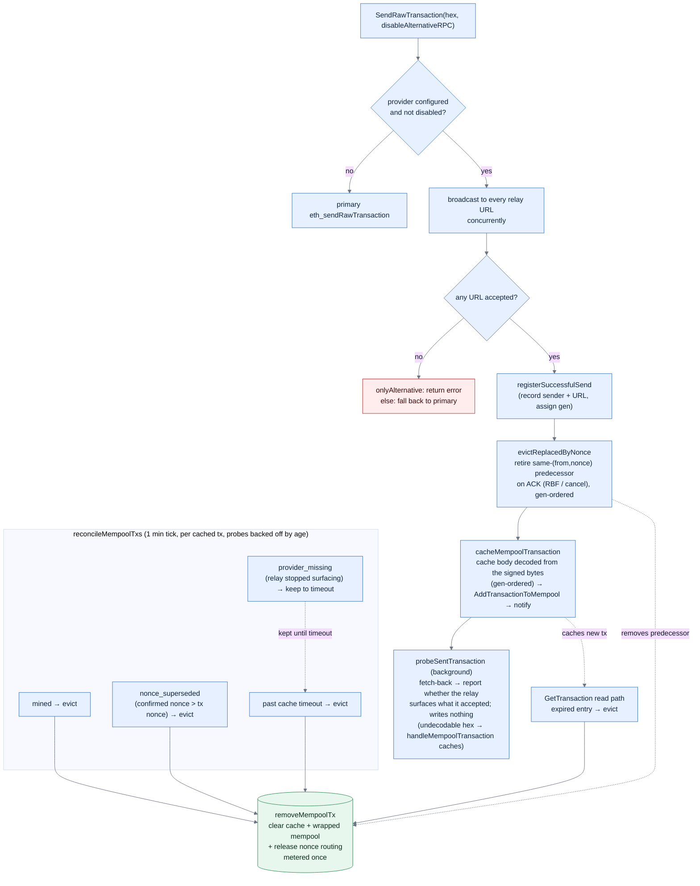

# EVM transaction submission

How Blockbook broadcasts a **Trezor Suite** EVM transaction through the private send-tx relay and
tracks it in its own pending-transaction cache until the chain confirms or supersedes it. Fee
estimation is covered in [fees.md](/docs/fees.md).

The private-relay path — the alternative send-tx provider and its pending-tx cache — is active only
when a coin is configured with `*_ALTERNATIVE_SENDTX_URLS`, `*_ALTERNATIVE_SENDTX_ONLY` and
`*_ALTERNATIVE_FETCH_MEMPOOL_TX`. Without them Blockbook sends through the normal backend RPC and the
cache path is skipped.

## Broadcast and the pending-transaction cache

`SendRawTransaction` broadcasts and, when the relay accepts in `ALTERNATIVE_SENDTX_ONLY` +
`ALTERNATIVE_FETCH_MEMPOOL_TX` mode, keeps its own pending-tx cache — the relay exposes no mempool to
reconcile against. A background loop and the read path reconcile that cache against the chain.

```mermaid
%%{init: {"theme": "base", "themeVariables": {"lineColor": "#6b7280", "primaryTextColor": "#111827"}}}%%
flowchart TD
    send["SendRawTransaction(hex, disableAlternativeRPC)"]
    route{"provider configured<br/>and not disabled?"}
    primary["primary eth_sendRawTransaction"]
    relay["broadcast to every relay URL<br/>concurrently"]
    acc{"any URL accepted?"}
    reject["onlyAlternative: return error<br/>else: fall back to primary"]
    reg["registerSuccessfulSend<br/>(record sender + URL, assign gen)"]
    evict["evictReplacedByNonce<br/>retire same-(from,nonce) predecessor<br/>on ACK (RBF / cancel), gen-ordered"]
    cache["cacheMempoolTransaction<br/>cache body decoded from the signed bytes<br/>(gen-ordered) → AddTransactionToMempool → notify"]
    handle["probeSentTransaction (background)<br/>fetch-back → report whether the relay<br/>surfaces what it accepted; writes nothing<br/>(undecodable hex → handleMempoolTransaction caches)"]

    subgraph rec ["reconcileMempoolTxs (1 min tick, per cached tx, probes backed off by age)"]
        mined["mined → evict"]
        super["nonce_superseded<br/>(confirmed nonce > tx nonce) → evict"]
        miss["provider_missing<br/>(relay stopped surfacing) → keep to timeout"]
        to["past cache timeout → evict"]
    end

    readpath["GetTransaction read path<br/>expired entry → evict"]
    remove[("removeMempoolTx<br/>clear cache + wrapped mempool<br/>+ release nonce routing<br/>metered once")]

    send --> route
    route -- "no" --> primary
    route -- "yes" --> relay --> acc
    acc -- "no" --> reject
    acc -- "yes" --> reg --> evict --> cache --> handle
    evict -. removes predecessor .-> remove
    cache -. caches new tx .-> readpath
    mined --> remove
    super --> remove
    miss -. "kept until timeout" .-> to
    to --> remove
    readpath --> remove

    classDef normal fill:#e7f0ff,stroke:#4078c0,color:#10243e;
    classDef store fill:#e8f7ed,stroke:#2e8b57,color:#0b2c19;
    classDef error fill:#ffecec,stroke:#c03535,color:#3b0a0a;
    class send,route,relay,acc,reg,evict,cache,handle,mined,super,miss,to,readpath,primary normal;
    class remove store;
    class reject error;
```

Key invariants:

- **On the relay-accepted path, the wallet's answer waits for the broadcast and nothing else.** The
  broadcast to every relay URL runs concurrently, so it costs the slowest URL, not their sum; caching
  is local work and the fetch-back is background. A wallet that gives up before Blockbook answers
  tells the user the send failed while it is on its way to the chain, and a re-send at the next nonce
  then pays the recipient twice. Trezor Suite's deadline is 20 s per request, 60 s for pushes once
  [trezor-suite#30846](https://github.com/trezor/trezor-suite/pull/30846) lands, against `rpc_timeout`
  of 25 s *per relay URL*.

  The fall-through path is not bounded that way. With no relay acceptance and
  `ALTERNATIVE_SENDTX_ONLY` unset, the answer also waits for the primary `eth_sendRawTransaction` and,
  on `disableMempoolSync` coins, for the mempool add that makes an own send visible: one primary
  `eth_getTransactionByHash` plus the pruned-index recovery's `eth_getTransactionReceipt` when that
  answers null, up to 3–4 × `rpc_timeout` in total. The same tail exists there with no relay at all.
  The add is skipped on a failed send — no txid to index.
- **An accepted send is cached from its own signed bytes, before the relay is asked about it.** The
  signed transaction carries everything a pending `RpcTransaction` needs, so the fetch-back writes
  nothing and only reports whether the relay surfaces what it accepted. It must not write: by then the
  transaction may have mined and block sync may have cleared it, and the relay's view can name a
  different hash, `to` or `value` than the bytes Blockbook was given. So a relay that accepts and then
  does not surface a transaction no longer leaves the send exposed nowhere — not served as pending,
  not indexed, not raising the pending-nonce floor, its nonce free to reuse. The txid is the hash of
  the signed bytes, not the relay's echo, so cache, address index and the wallet's answer all name what
  the chain will show. Exception: an undecodable raw transaction, where nothing can be derived and the
  fetch-back keeps its create semantics as the only thing that can expose the send.
- **What is cached is what a relay accepted, which is not the same as what will mine.** A transaction
  the relay drops or never mines — a Blink drop-mode cancel is the deliberate case — holds its nonce
  slot, and with it the pending-nonce floor, for the whole pending window; the wallet's next send is
  built above a nonce nothing will consume. That is the accepted side of the #1638 trade: a reserved
  dead nonce beats handing out one that is genuinely in flight. What bounds it is the floor's
  contiguity rule, not the three-hour timeout — the floor never advances *past* an unfilled slot, so
  the wallet always gets a usable nonce and only the stuck private transaction is affected, not every
  send after it (#1675). Suite can speed it up or cancel it for the whole window.
- **Every same-`(from, nonce)` predecessor is retired the moment the relay ACKs its replacement** —
  only one transaction per slot can mine — from the raw hex, not on the relay surfacing the
  replacement: a Blink drop-mode cancel is never surfaced and never consumes its nonce on-chain, which
  left the superseded tx "Unconfirmed" until the cache timeout (#1573). This is deliberately distinct
  from an *empty* `eth_getTransactionByHash` probe, which
  is **not** authoritative: a private relay stops surfacing a still-mineable tx while it stays
  broadcast, so `provider_missing` is kept until the timeout. `mined` and `nonce_superseded` are
  reconcile's only deterministic early evictions.
- **Send generations order concurrent same-nonce sends.** Each accepted send gets a monotonic
  generation; an older submission's slow fetch-back neither caches itself over, nor evicts, a newer
  replacement that already holds the nonce slot.
- **Every exit funnels through `removeMempoolTx`** (see the diagram for what it clears), which records
  the lifecycle metric exactly once — gated on the actual removal, so concurrent reconcile /
  read-path / RBF evictions of the same entry don't double-count.
- **Removals are not pushed to the wallet.** Blockbook pushes only *added* txs; a wallet learns a
  pending tx is gone on its next account re-fetch (the initiating device also removes it
  optimistically). The cache timeout, at the pending window's length, is only the backstop, so `mined`
  and `nonce_superseded` retire an entry in practice.

## How long a private transaction stays pending

A relay dropping a transaction from `eth_getTransactionByHash`, or from the pending nonce it reports,
is **not** the transaction being gone: it stays broadcast and builders can still include it. Blinklabs
puts that window at around three hours, and is widening both RPC answers to match what used to be
roughly a minute. Blockbook is sized to that window, not to how long the relay talks about it:

| setting | default | what it governs |
|---|---|---|
| `alternativePendingTxWindow` | 3 h | how long a relay-accepted transaction is served as pending and its nonce slot reserved |
| `alternativeMempoolTxTimeout` | the window | the cache retention, if it should differ from the window |
| `mempoolTxTimeout` | cache retention + 30 min | the wrapped mempool, which must outlive the cache — Blockbook refuses to start if an explicit value inverts the pair |
| relay routing (`useForNonces`) | 15 min | how long the sender's `eth_getTransactionCount` and `eth_estimateGas` go to the relay rather than the primary backend |

The routing horizon is deliberately the odd one out. Once the send is cached, the pending-nonce floor
is applied to the primary backend's answer too, so a sender released from routing gets the same nonce.
`eth_estimateGas` rides the same gate and is called once per send-form keystroke, which is how the
relay's rate quota was exhausted in [#1629](https://github.com/trezor/blockbook/issues/1629).

**Rollout order matters.** An empty `eth_getTransactionByHash` is still treated as non-authoritative
(`provider_missing` is kept until the cache timeout), and that must not change before the relay's own
three-hour window is live — flipping it earlier evicts private transactions after about a minute
again, which is [#1573](https://github.com/trezor/blockbook/issues/1573). The acceptance signal is
`blockbook_eth_alternative_pending_floor_raised_total{source="provider"}`: it fires today *because*
the relay drops a still-cached transaction from its pending count, so it collapsing toward zero is
what says the relay is answering over the full window.

## Observability

Prometheus counters for the cache lifecycle:

- `blockbook_eth_alternative_mempool_reconciliation_events_total{action}` — cache exits by reason
  (`mined`, `nonce_superseded`, `provider_missing`, `timeout`, `rbf_replaced`, `sync_removed`) plus
  the kept actions (`skipped_fresh`, `skipped_backoff`, `provider_missing_pending`, `kept`,
  `provider_error`). `sync_removed` — block sync indexing the tx's block, or the read path finding it
  mined — should dominate, `mined` should be rare.
- `blockbook_eth_alternative_mempool_tx_residence_seconds{action}` — entry lifetime per eviction
  reason. `provider_missing` belongs near the cache timeout; collapsing to minutes is the
  premature-eviction regression #1573 describes.
- `blockbook_eth_alternative_mempool_cache_size` — current cache depth.

Signals for *hanging* private transactions — a tx stuck Unconfirmed, or a nonce pinned above a dead
on-chain gap:

- `blockbook_eth_alternative_mempool_oldest_age_seconds` — age of the oldest cached entry, sampled per
  reconcile cycle; the residence histogram records an age only once an entry leaves, so a stuck tx is
  otherwise invisible until it times out. Climbing toward the cache timeout at non-zero depth means
  cached txs are dying underpriced rather than mining — a drop-mode cancel, which never mines by
  design, is the benign cause to rule out.
- `blockbook_eth_alternative_send_not_surfaced_total{reason}` — a relay-accepted send the fetch-back
  did not surface (`not_found`/`error`) or never ran at all (`dropped`); the tx is still cached and
  indexed from its signed bytes, so this is not a nonce-reuse precursor, but only the cache timeout can
  retire the entry. `dropped` is counted only on the raw-hex-decode-failure path (logged as `cannot
  decode accepted transaction`), where the fetch-back was the one thing that could expose the send —
  there it really is exposed nowhere.
- `blockbook_eth_alternative_pending_floor_raised_total{source}` — `raiseToPendingFloor` lifted the
  pending nonce above the backend's own answer (`provider`: the relay dropped a still-cached tx past
  its own pending window; `primary`: the fallback RPC never knew it). Tracks private-send activity,
  not faults.
- `blockbook_eth_alternative_pending_floor_stranded_total{source}` — the cache holds a private tx at a
  nonce *above* the run the floor could advance over, i.e. a slot nothing Blockbook knows of fills; the
  floor stops below the hole, so the wallet still gets a usable nonce while that transaction cannot
  mine until the hole is filled. Should be ~0; a sustained rate on `provider` means relay-accepted
  sends are not reaching the cache. Each sample is one request, not one transaction, so the rate
  follows wallet polling.
