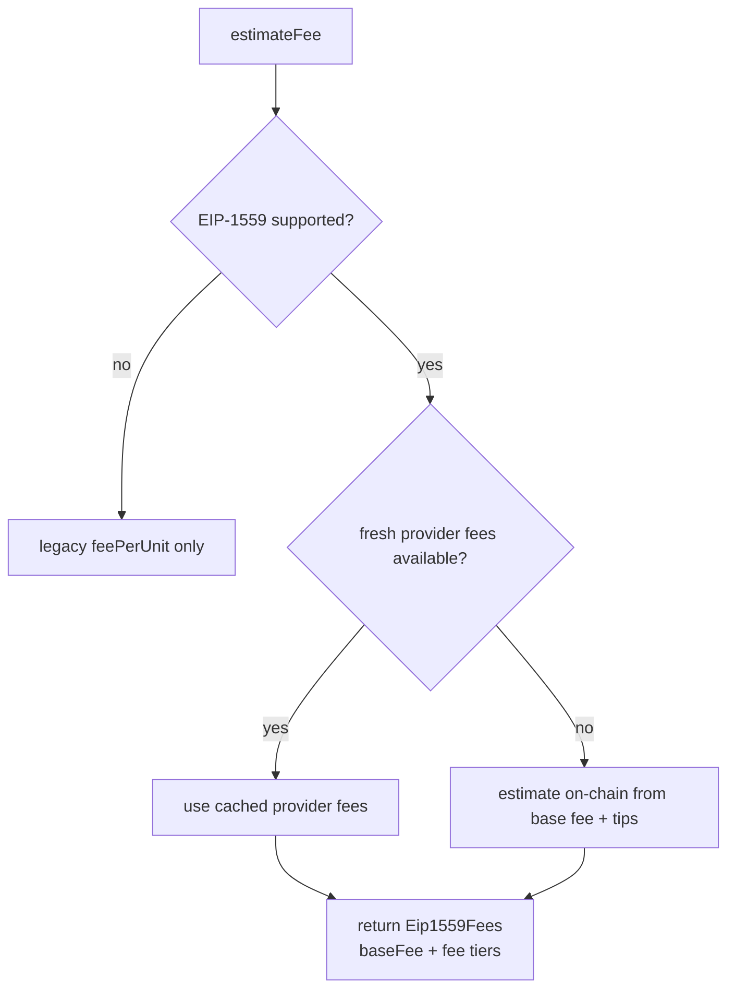
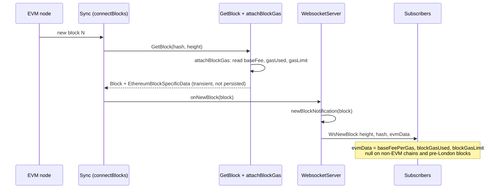
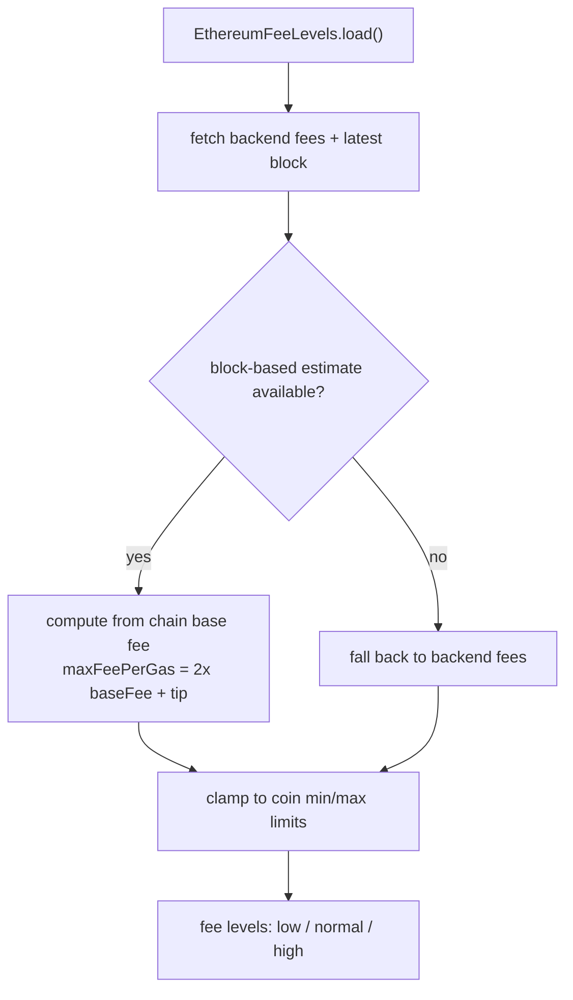
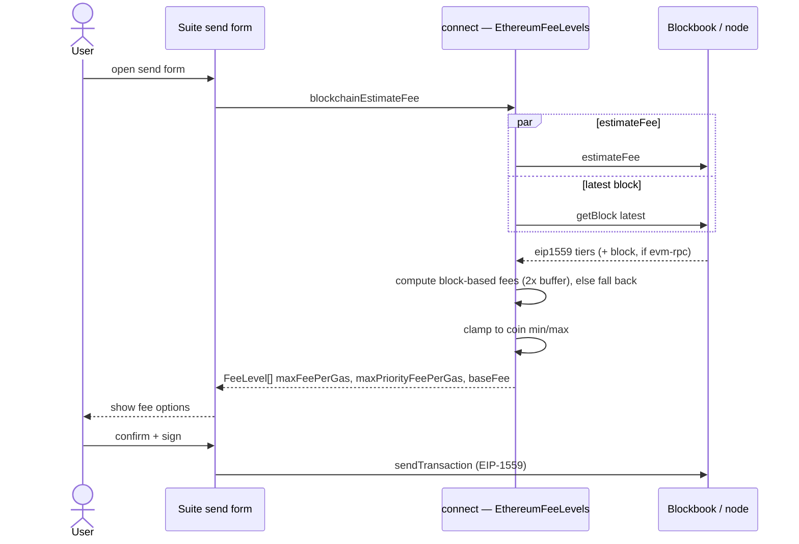

# EVM EIP-1559 fee estimation

This document describes how EIP-1559 fees are produced for EVM coins across **Blockbook**
(the indexer) and **Trezor Suite** (the wallet), and which component owns which decision.

## Responsibilities

The split is deliberate: Blockbook supplies facts, the wallet decides policy.

**Blockbook — provides ground-truth inputs:**

- base fee — the next-block projection, taken from the chain
- priority-fee tiers (tips)
- congestion and trend signals (via the configured alternative provider, when supported)
- per-block gas — `baseFee`, `gasUsed`, `gasLimit`

**Trezor Suite — owns the fee policy:**

- chooses the base-fee source
- applies the head-room buffer (currently `2×`)
- composes `maxFeePerGas = 2 × baseFee + tip`
- clamps to per-coin `minFee` / `minPriorityFee` / `maxFee` limits
- displays the fee options and signs the transaction

This is why the wallet computes `maxFeePerGas` itself instead of trusting a provider's pre-padded
value (e.g. Infura's `suggestedMaxFeePerGas`, which was the source of the "fees too high" reports).

---

## Blockbook — pull path (`estimateFee` / `EthereumTypeGetEip1559Fees`)

On-demand estimate. Returns `Eip1559Fees`: a `baseFeePerGas` plus `low/medium/high` (and `instant`
on the on-chain path) tiers, and — on supported provider paths — congestion/trend ranges.



How each source is built:

- **On-chain** (coins with no provider, or a stale one — e.g. `ethereum` non-archive, ETH testnets):
  one `eth_feeHistory` call (4 blocks, newest = `pending`) yields the next-block `baseFeePerGas`
  (array index `blocks-1`) and per-tier reward percentiles (20/70/90/99) used as tips. Blockbook
  builds `maxFeePerGas = eip1559BaseFeeMultiplier(2) × baseFee + tip`. (Previously this field held the
  tip alone — below the base fee, so not mineable; that was fixed.)
- **Alternative provider** (archive coins, served from an in-memory cache, no node RPC): blockbook
  returns the provider's `maxFeePerGas` **unchanged**. For Infura, this is `suggestedMaxFeePerGas`,
  padded well above the base fee (~2.5× for the high tier); for 1inch, it is the provider's own
  computed `maxFeePerGas`. Blockbook does not rewrite it — the wallet overrides it (see the Suite
  section).

---

## Blockbook — push path (`subscribeNewBlock` → `evmData`)

Every connected block is pushed to subscribers with its block-level gas, so a wallet can keep its
fee projection fresh without polling. No extra RPC — the data comes from the block header already
fetched during sync.



---

## Trezor Suite — `EthereumFeeLevels` (the fee policy)

Suite computes its own fees from the chain's base fee plus a `2×` buffer, preferring that block-based
estimate and falling back to the backend's tiers when block data is unavailable (so nothing regresses).



Details and current coverage:

- The block-based estimate derives the next-block base fee from the latest block (EIP-1559 formula on
  `gasUsed`/`gasLimit`), takes tips from the block's transaction `maxPriorityFeePerGas` percentiles,
  and sets `maxFeePerGas = 2 × nextBaseFee + tip`. The fallback uses the backend's `eip1559` tiers.
- **evm-rpc-backed networks**: `getBlock('latest')` returns block gas → block-based fees apply.
- **blockbook-backed networks**: `getBlock('latest')` is unsupported → block-based estimate is empty →
  Suite falls back to the backend (provider) tiers. Wiring the `subscribeNewBlock` `evmData` push as the
  block-data source for these networks is the remaining step.

---

## End-to-end flow



---

## The `maxFeePerGas` formula

Both blockbook's on-chain path and Suite's block-based path compute the same value:

```
maxFeePerGas = 2 × baseFee + tip
```

- **base fee** — consensus-determined for the next block (deterministic from the parent header), so it
  is taken from the chain, never from an oracle estimate.
- **tip** (`maxPriorityFeePerGas`) — the only estimated part; from fee-history reward percentiles, or
  the provider's per-tier suggestion.
- **`2×` buffer** — the wallet's policy knob. It absorbs roughly 6 consecutive full blocks of base-fee
  growth (the base fee can rise at most 12.5% per block) before a transaction stalls, and EIP-1559
  refunds the unused part. In blockbook it is the `eip1559BaseFeeMultiplier` constant; in Suite it is
  applied in `EthereumFeeLevels`.
