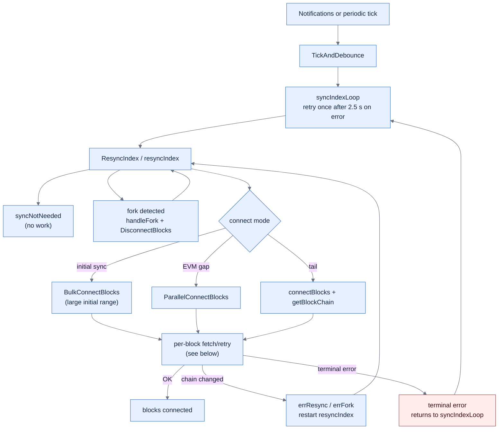
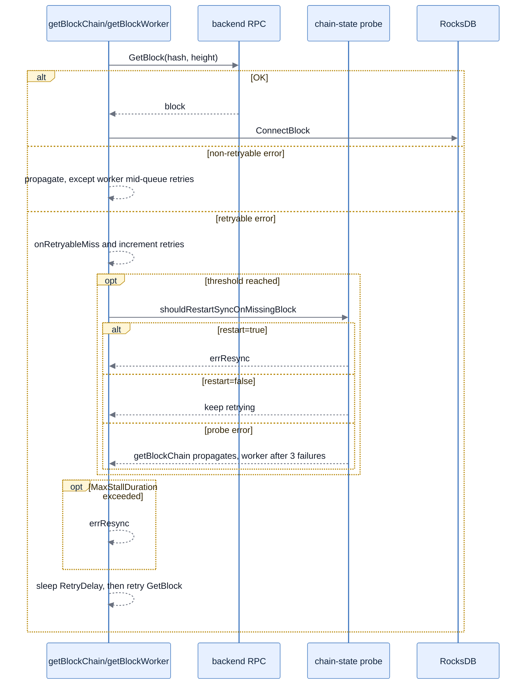

# Sync

The sync engine connects blocks from the backend RPC into the local RocksDB index. It is driven by external block notifications (EVM `newHeads`, BTC ZMQ) and an internal periodic tick. This page documents the loop and the knobs that govern how it recovers from transient backend trouble.

## Sync loop



The per-block retry loop is shared by `getBlockChain` and `getBlockWorker`. Probe errors are path-specific: `getBlockChain` propagates immediately, while workers retry until three consecutive probe failures.



`errResync` and `errFork` cause `resyncIndex` to be re-entered (handling the new chain state); any other error propagates up and `syncIndexLoop` retries once before waiting for the next trigger.

## Troubleshooting

The retry policy is exposed per chain under `additional_params.missingBlockRetry` in `configs/coins/*.json`. Each field is optional; missing or `<= 0` values fall back to the built-in defaults below.

| Knob                  | Current default | Where it bites                                                                  | Semantic                                                              |
| --------------------- | --------------- | ------------------------------------------------------------------------------- | --------------------------------------------------------------------- |
| `RetryDelay`          | 1 s             | `getBlockWorker` (parallel) directly; `getBlockChain` clamps to ≤ 250 ms regardless | Sleep between successive `GetBlock` attempts for the same missing block |
| `RecheckThreshold`    | 10              | `getBlockWorker` mid-queue                                                      | Retries before calling `shouldRestartSyncOnMissingBlock`              |
| `TipRecheckThreshold` | 3               | both loops, at the tail                                                         | Retries before chain-state probe, when we're near the tip             |
| `MaxStallDuration`    | 60 s            | both loops                                                                      | Wall-clock cap before yielding `errResync`                            |

Example override (JSON keys are camelCase with the `Ms` suffix for durations):

```json
"additional_params": {
    "missingBlockRetry": {
        "retryDelayMs": 1000,
        "recheckThreshold": 10,
        "tipRecheckThreshold": 3,
        "maxStallMs": 60000
    }
}
```

When an override is applied, blockbook logs one `sync: missingBlockRetry override applied: …` line at startup so you can confirm the effective values.

Related Prometheus counters for observing the budget at runtime:

- `blockbook_index_block_not_found_retries` — every transient `ErrBlockNotFound` observed during sync.
- `blockbook_index_sync_yields{reason="deadline"|"probe_failed"}` — wall-clock cap fired vs chain-state probe failed three times.
- `blockbook_index_reorg_events{type="fork"|"resync"|"disconnect"}` — real reorg signals (not stall yields).
