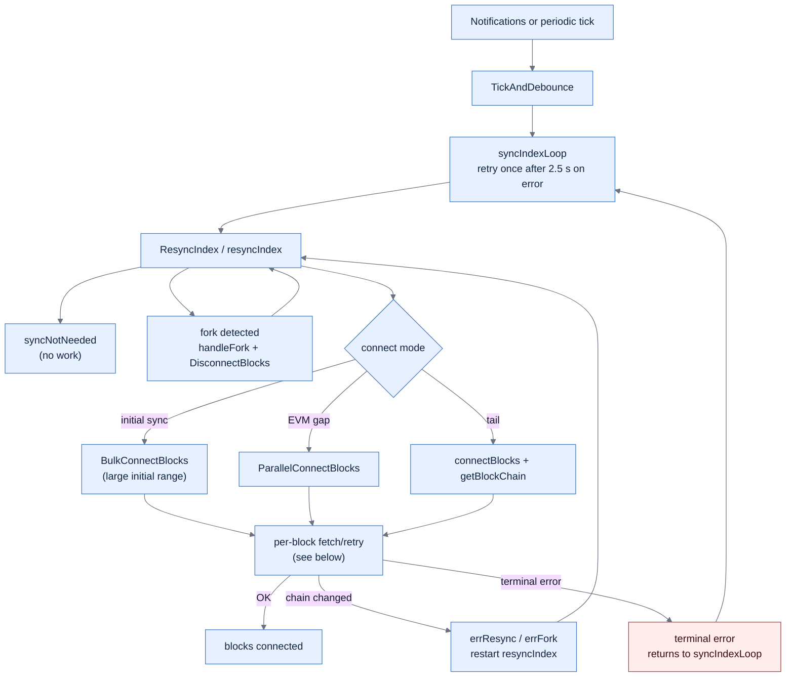
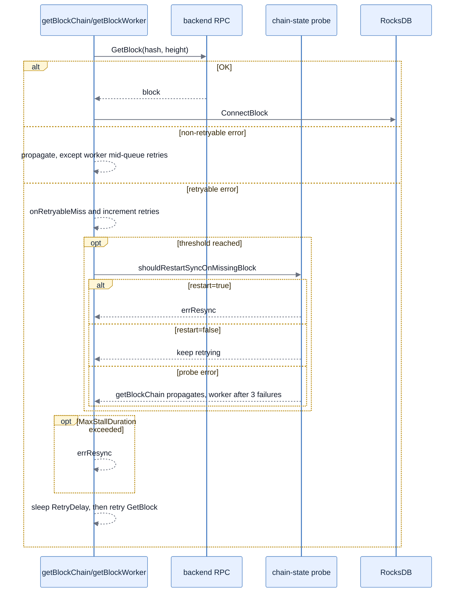
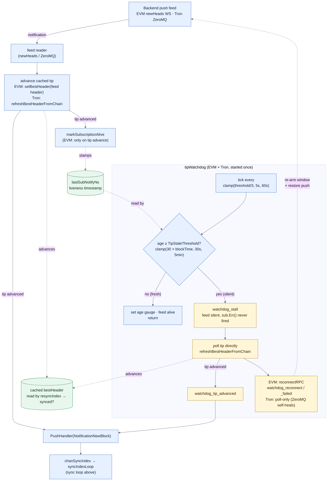

# Sync

The sync engine connects blocks from the backend RPC into the local RocksDB index. It is driven by external block notifications (EVM `newHeads` WebSocket, Tron ZeroMQ, BTC ZMQ) and an internal periodic tick. This page documents the loop, the [tip feed](#tip-feed-and-the-stall-watchdog) that drives it, and the knobs that govern how it recovers from transient backend trouble.

## Sync loop



The per-block retry loop is shared by `getBlockChain` and `getBlockWorker`. Probe errors are path-specific: `getBlockChain` propagates immediately, while workers retry until three consecutive probe failures.



`errResync` and `errFork` cause `resyncIndex` to be re-entered (handling the new chain state); any other error propagates up and `syncIndexLoop` retries once before waiting for the next trigger.

## Tip feed and the stall watchdog

The "Notifications" that wake the loop above are not free-standing — for EVM and Tron they come from a single cached best-header that is advanced **only** by a backend push feed (EVM `newHeads` WebSocket, Tron ZeroMQ). `resyncIndex` reads that cached tip to decide whether work is needed, so a feed that goes quiet freezes the tip and the loop silently concludes `syncNotNeeded`.

The failure mode that motivated this is a load balancer that drops the upstream **without** signalling `sub.Err()`: the error-driven resubscribe never fires, the cached tip freezes, and the index stalls until the ~15-minute periodic tick — with no error logged and no metric moving. The `tipWatchdog` closes that gap by watching feed liveness directly and healing a silent feed.



Key invariants this design relies on:

- **The cached tip is advanced from the feed's own header, not re-derived over the load-balanced call path (EVM).** `newHeads` (WS) is sticky to one upstream, but JSON-RPC calls (`HeaderByNumber`, `GetBlock`) are load-balanced across the pool and can land on a lagging node. Re-querying the tip over that path could read a stale height and silently freeze sync into a false "synced" even while `newHeads` keeps flowing; instead the header delivered by the feed sets the tip directly via `setBestHeader`, which is **monotonic** so a resubscribe onto a slightly-behind node cannot regress the tip and trip a spurious fork. Blocks the call path cannot yet serve surface as ordinary `ErrBlockNotFound` and are absorbed by the [retry budget](#troubleshooting) — visible via `block_not_found_retries` / `sync_yields` — rather than hidden as a frozen tip. (Tron's ZeroMQ notification carries no header, so it still re-queries via `refreshBestHeaderFromChain`.) The monotonic guard only filters *transient* lag, which resolves within seconds; a backend that **genuinely rolls back** to a lower height and stays there delivers only sub-tip heads that the guard keeps rejecting, so the cached tip would otherwise freeze above the backend (equal to the local DB tip) and `resyncIndex` would early-exit as "synced" forever, never reaching its `GetBlockHash(localBestHeight)` fork path. Because rejected heads do not refresh liveness, this case ages the feed past `TipStaleThreshold` like any silent feed, so `tipWatchdog` fires and re-polls the tip **with the monotonic guard lifted** (`refreshBestHeaderFromChain(allowRegress=true)`): a still-lower height after the full stall window is treated as a real rollback, the cached tip follows the backend down (emitting `watchdog_tip_rollback`), and the next `resyncIndex` reaches the fork/disconnect path. A fluke lower poll cannot corrupt state — `resyncIndex` re-confirms via an independent `GetBlockHash`, and a chain that is actually still at the higher tip simply re-advances on the next header.
- **The liveness timestamp is armed when the subscription is established and refreshed only by a feed-driven tip advance.** `markSubscriptionAlive` (EVM) / `markNotifyAlive` (Tron) is stamped on the push-feed path, never by the watchdog's own fallback poll — so a watchdog that is carrying sync can never mask a dead feed: `age` keeps growing until real push delivery resumes. On EVM it is refreshed **only when the delivered header actually moved the tip forward**, so the watchdog also catches a feed that keeps delivering but is stuck on one height (a load-balancer upstream that stopped advancing), not just one that went fully silent. Crucially, EVM also stamps it **once at subscribe time** (`subscribeEvents`): the watchdog's `lastSubNotifyNs == 0` gate uses it as a proxy for "subscription wired up", so if it were stamped *only* on advance, a subscription that comes up silently behind a load balancer (never advancing) would leave the gate closed and the watchdog disabled forever — the cached tip would freeze into a false "synced" with no error or metric. Seeding at subscribe time means even a born-silent feed ages past the threshold and gets polled/reconnected. The watchdog re-arms the window after a *successful* EVM reconnect (and Tron re-arms after each poll to avoid polling every tick during a legitimate lull).
- **`TipStaleThreshold` is chain-aware.** `clamp(30 × averageBlockTimeMs, 30s, 5min)` replaces the old fixed 15 minutes, which on Polygon's 2 s blocks meant ~450 missed blocks before any reaction. Per-chain values: Polygon/Optimism/Base/Avalanche 60 s, BSC/Tron 90 s, Arbitrum 30 s (floor), Ethereum 5 min (cap). The sample interval is `clamp(threshold/3, 5s, 60s)`.
- **Reader goroutines start once.** `newBlockNotifier`, `tipWatchdog`, and the `NewBlock`/`NewTx` channel readers are launched under a `sync.Once`; `reconnectRPC` only re-creates the `EthSubscribe`-bound subscriptions, so a reconnect no longer leaks a fresh reader set. `getBestHeader` no longer does a lock-held passive reconnect — liveness is owned by the watchdog, off the `bestHeaderLock`, so a reconnect can't block concurrent tip readers.

EVM coverage is inherited by every coin built on `EthereumRPC` (Ethereum, Polygon, BSC, Arbitrum, Optimism, Base, Avalanche); Tron runs the same watchdog poll-only over its ZeroMQ feed. BTC-family coins do not use this cached-tip feed and are unaffected.

## Troubleshooting

The retry policy is exposed per chain under `additional_params.missingBlockRetry` in `configs/coins/*.json`. Each field is optional; missing or `<= 0` values fall back to the built-in defaults below.

| Knob                  | Current default | Where it bites                                                                  | Semantic                                                              |
| --------------------- | --------------- | ------------------------------------------------------------------------------- | --------------------------------------------------------------------- |
| `RetryDelay`          | 1 s             | `getBlockWorker` (parallel) directly; `getBlockChain` clamps to ≤ 250 ms regardless | Sleep between successive `GetBlock` attempts for the same missing block |
| `RecheckThreshold`    | 10              | `getBlockWorker` mid-queue                                                      | Retries before calling `shouldRestartSyncOnMissingBlock`              |
| `TipRecheckThreshold` | 3               | both loops, at the tail                                                         | Retries before chain-state probe, when we're near the tip             |
| `MaxStallDuration`    | 60 s            | both loops                                                                      | Wall-clock cap before yielding `errResync`                            |

Example override (JSON keys are camelCase with the `Ms` suffix for durations):

```json
"additional_params": {
    "missingBlockRetry": {
        "retryDelayMs": 1000,
        "recheckThreshold": 10,
        "tipRecheckThreshold": 3,
        "maxStallMs": 60000
    }
}
```

When an override is applied, blockbook logs one `sync: missingBlockRetry override applied: …` line at startup so you can confirm the effective values.

Related Prometheus counters for observing the budget at runtime:

- `blockbook_index_block_not_found_retries` — every transient `ErrBlockNotFound` observed during sync.
- `blockbook_index_sync_yields{reason="deadline"|"probe_failed"}` — wall-clock cap fired vs chain-state probe failed three times.
- `blockbook_index_reorg_events{type="fork"|"resync"|"disconnect"}` — real reorg signals (not stall yields).

For the [tip feed](#tip-feed-and-the-stall-watchdog) (EVM and Tron only):

- `blockbook_backend_subscription_age_seconds` — seconds since the feed last delivered a notification. Healthy: hovers near the chain's block time. A sustained climb to `TipStaleThreshold` (the value `clamp(30 × blockTime, 30s, 5min)` from the watchdog section) means the feed went silent and the watchdog is carrying sync; climbing without bound means the backend is unreachable.
- `blockbook_backend_subscription_events{subscription,event}` — feed lifecycle. `subscription` ∈ `newHeads`, `newPendingTransactions`, `rpc`, `zeromq`; `event` ∈ `watchdog_tick`, `error`, `resubscribed`, `resubscribe_failed`, `watchdog_stall`, `watchdog_tip_advanced`, `watchdog_tip_rollback`, `watchdog_reconnect`, `watchdog_reconnect_failed`. To alert on: `watchdog_tip_advanced` (the fallback poll found blocks the feed had dropped — the push feed is broken), `watchdog_tip_rollback` (the backend's tip dropped below ours and stayed there past the stall window — a real rollback the watchdog regressed the cached tip to so sync could reconcile the fork; EVM only, since Tron's tip is non-monotonic and follows the backend down directly), and a sustained `subscription_age_seconds` at the threshold.
- `blockbook_backend_subscription_events{event="watchdog_tick"}` — incremented once per watchdog evaluation (~every `clamp(TipStaleThreshold/3, 5s, 60s)`). It is the watchdog's heartbeat: the watchdog is the **sole** healer for a silent feed, so if its single goroutine parks (e.g. on a hung reconnect) every other stall signal can lie. `rate(...{event="watchdog_tick"}[2m]) == 0` while the process is up means the watchdog stopped ticking — a parked healer.

To detect a **stalled sync** (the silent class this watchdog exists for — index not advancing while the process is healthy), alert on:

- `blockbook_synchronized == 0` sustained (≳ a few minutes) outside initial sync — mirrors `/api/status` `inSync`, so `0` means the index is not keeping up with the tip. This is the single clearest "not OK" signal; it folds in the per-chain freshness/grace logic, so a fast EVM chain at the tip still reads `1`.
- `blockbook_tip_age_seconds > 30 * blockbook_average_block_time_seconds` (guard `blockbook_average_block_time_seconds > 0`) — the observed tip has not advanced in ~30 block intervals. Independent of the watchdog: it climbs whether the feed died, the watchdog parked, or the backend genuinely paused.
- `rate(blockbook_backend_subscription_events{event="watchdog_tick"}[2m]) == 0` (EVM/Tron) — distinguishes a **parked watchdog** from a backend that simply paused: if ticks stopped, the healer itself is dead.
